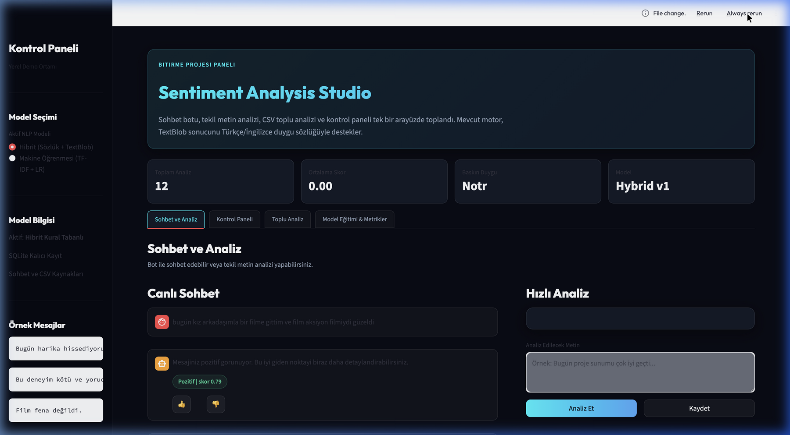

# 🌌 Sentiment Analysis Studio: Hibrit ve Makine Öğrenmesi Tabanlı Türkçe Duygu Analizi ve Aktif Öğrenme Sohbet Robotu

Bu proje, Türkçe metinler üzerinde yüksek doğrulukla duygu analizi gerçekleştiren, bünyesinde **Kural Tabanlı/Sözlük Destekli Hibrit Yaklaşım** ile **TF-IDF + Lojistik Regresyon Tabanlı Makine Öğrenmesi** modellerini barındıran, interaktif bir Streamlit web paneli ve SQLite kalıcı veri tabanı katmanıyla desteklenmiş kapsamlı bir **Doğal Dil İşleme Projesidir **.

Projenin en ayırt edici özelliği; kullanıcılardan gelen düzeltmeleri anlık olarak eğitim veri setine dahil eden **Aktif Öğrenme (Feedback Loop / Geri Bildirim Döngüsü)** mimarisine sahip olmasıdır.

---

## 📸 Arayüz Ekran Görüntüsü



---

## 🚀 Öne Çıkan Özellikler

1. **Çift NLP Model Desteği**:
   * **Hibrit Model (Sözlük + TextBlob)**: Türkçe ek/kök morfolojik yapılarını ve olumsuzluk eklerini (örn. *-me*, *-ma*, *değil*) algılayan gelişmiş Türkçe/İngilizce sözlük ile TextBlob kütüphanesini birleştiren hibrit motor.
   * **Makine Öğrenmesi Modeli (TF-IDF + Logistic Regression)**: `data/turkish_sentiment_dataset.csv` üzerindeki verilerle eğitilen, n-gram (1-2) kelime gruplarını analiz edebilen fütüristik sınıflandırıcı.

2. **Canlı Kelime Vurgulama (Visual Text Highlighting)**:
   * Mesaj içerisindeki kelimelerin duyguya katkısı kelime bazında hesaplanır.
   * Pozitif katkı sağlayan kelimeler **yeşil**, negatif katkı sağlayan kelimeler **kırmızı** fütüristik neon ışımalı cam etiketlerle görselleştirilir.

3. **Aktif Geri Bildirim Döngüsü (Active Learning Loop)**:
   * Botun yaptığı hatalı duygu tahminleri için sohbet satırındaki 👎 butonuna basılarak düzeltme yapılır.
   * Düzeltilen veri, doğrudan `data/turkish_sentiment_dataset.csv` eğitim veri setine eklenir ve SQLite veritabanında arşivlenir.
   * Kullanıcı tek tıkla modeli bu yeni verilerle tekrar eğitebilir.

4. **Kapsamlı Yönetim & Kontrol Paneli**:
   * **Sohbet Arayüzü**: Robotla canlı sohbet ve anlık detaylı duygu grafiği.
   * **İstatistik Paneli**: Toplam analiz sayısı, ortalama duygu skoru, baskın duygu sınıfları ve zaman serisi eğilim grafikleri.
   * **Toplu Analiz (CSV / Batch Processing)**: Binlerce satırlık CSV dosyalarını saniyeler içinde analiz etme, sonuçları indirme veya tek tıkla SQLite veritabanına kaydetme imkanı.
   * **Model Eğitimi & NLP Metrikleri**: Modelin veri dağılımını izleme, eğitim başlatma ve doğruluk (accuracy), precision, recall, F1-skoru değerlerini sınıf bazında inceleme.

---

## 🛠️ Proje Yapısı ve Mimarisi

```text
ChatBot-for-Sentiment-Analysis/
│
├── app/
│   ├── chatbot.py           # Duygu analizine göre sohbet robotu yanıt motoru
│   ├── database.py          # SQLite veritabanı CRUD işlemleri ve geri bildirim yönetimi
│   ├── sentiment.py         # Hibrit duygu analizi motoru ve ML öngörü mekanizması
│   └── train_model.py       # ML Modeli eğitimi, TF-IDF + Logistic Regression boru hattı
│
├── assets/
│   └── dashboard.png        # Arayüz tanıtım ekran görüntüsü
│
├── data/
│   ├── sentiment_chatbot.sqlite3 # SQLite kalıcı veritabanı (otomatik oluşturulur)
│   ├── turkish_sentiment_dataset.csv # Aktif öğrenmeye dayalı eğitim veri seti
│   └── training_results.json # Model eğitim metrik raporu (Json)
│
├── sample_data/
│   └── reviews.csv          # Toplu analiz testi için örnek yorum dosyası
│
├── tests/
│   └── test_sentiment.py    # Pytest birim testleri (Sentiment motoru testleri)
│
├── main.py                  # CLI (Terminal) tabanlı sohbet arayüzü
├── streamlit_app.py         # Premium Streamlit Web arayüzü ve CSS teması
├── requirements.txt         # Gerekli kütüphaneler listesi
├── pytest.ini               # Test yapılandırması
└── README.md                # Proje tanıtım belgesi
```

---

## 💻 Kurulum ve Çalıştırma

### 1. Gereksinimler
Sisteminizde **Python 3.9** veya üzeri bir sürümün kurulu olduğundan emin olun.

### 2. Sanal Ortam Oluşturma ve Paket Kurulumu
Proje dizininde terminali açarak aşağıdaki komutları sırasıyla çalıştırın:

```bash
# Proje dizinine geçiş yapın
cd ChatBot-for-Sentiment-Analysis

# Sanal ortam oluşturun
python3 -m venv .venv

# Sanal ortamı aktif hale getirin (macOS / Linux)
source .venv/bin/activate

# Windows kullananlar için:
# .venv\Scripts\activate

# Pip aracını güncelleyin ve paketleri yükleyin
python -m pip install --upgrade pip
python -m pip install -r requirements.txt
```

### 3. Uygulamayı Başlatma (Streamlit Arayüzü)
```bash
streamlit run streamlit_app.py
```
Uygulama başarıyla başlatıldığında tarayıcınızda otomatik olarak şu adres açılacaktır:
[http://localhost:8501](http://localhost:8501)

### 4. Terminal Üzerinden Çalıştırma (CLI Modu)
Eğer web arayüzü yerine terminalden sohbet robotunu test etmek isterseniz:
```bash
python main.py
```

---

## 🧪 Birim Testlerinin Koşturulması
Kod kalitesini ve duygu analizi motorunun kararlılığını test etmek için `pytest` kullanılmıştır:

```bash
pytest
```
*Tüm test senaryolarının (pozitif, negatif, nötr metin analizi ve kelime vurgulama motoru) başarıyla geçtiğini gözlemleyebilirsiniz.*

---

## 🧠 Model Algoritmaları ve Matematiksel Altyapı

### A. Hibrit Duygu Analizi Motoru
Metin öncelikle küçük harflere dönüştürülür ve noktalama işaretlerinden arındırılır. Cümle kelimelerine ayrılarak Türkçe morfolojik olumsuzluk ekleri (`-me`, `-ma`, `değil`) kontrol edilir:
$$\text{Skor} = \sum_{w \in \text{Metin}} \text{Lexicon}(w) \times \text{Modifikatör}$$
TextBlob polarity skoru da eklenerek nihai polarite değeri $[-1.0, 1.0]$ aralığına normalize edilir.

### B. TF-IDF + Logistic Regression
Makine öğrenmesi modelinde, metinler n-gram aralığı (1, 2) olan TF-IDF vektörleştiriciden geçirilir. Lojistik Regresyon modeli, çoklu sınıflı (Positive, Negative, Neutral) duygu tahmini yapar. Kelime duygu katsayıları hesaplanırken modelin `coef_` katsayı matrisi kullanılır:
$$\text{Katkı}(w) = \text{Score}_{\text{Positive}}(w) - \text{Score}_{\text{Negative}}(w)$$
Bu sayede her kelimenin cümlenin duygu yönüne olan logaritma-olasılık (log-odds) etkisi hesaplanarak canlı arayüzde vurgulanır.

---

## 🎓 Akademik Değerlendirme & Doğal Dil İşleme Projesi Kriterleri

Bu proje, bir lisans Doğal Dil İşleme projesinde aranan şu akademik kriterleri tam olarak karşılamaktadır:
* **Yazılım Mühendisliği Prensipleri**: Kodlar modülerdir (`app/` ve `tests/` ayrımı), veritabanı işlemleri soyutlanmıştır.
* **Veri Yönetimi**: SQLite ilişkisel veritabanı entegrasyonu sayesinde kullanıcı geçmişi ve geri bildirimler kalıcı olarak saklanır.
* **Yapay Zeka ve NLP**: Hem geleneksel kural tabanlı yaklaşımlar hem de makine öğrenmesi algoritmaları kıyaslanarak sunulmuştur.
* **Kullanıcı Deneyimi**: Streamlit üzerinde en son CSS özellikleri (cam efekti, koyu uzay teması, anlık arama ve dinamik grafikler) kullanılarak üst düzey bir arayüz geliştirilmiştir.
